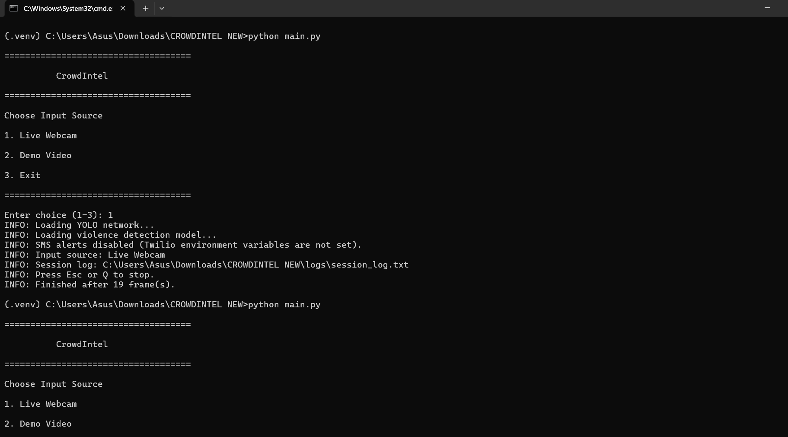
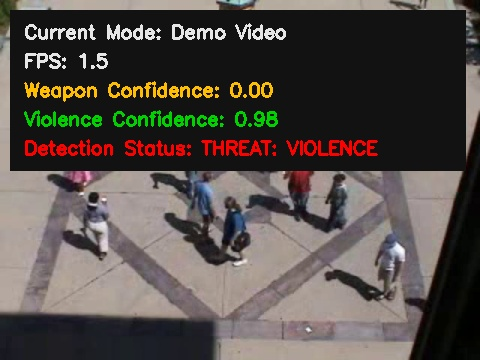

# CrowdIntel

CrowdIntel is a project developed to detect potential security threats using Computer Vision and Deep Learning.

The project combines **YOLOv3** for weapon detection and a **TensorFlow CNN model** for abnormal crowd behaviour detection. It can analyse both live webcam footage and recorded videos. Whenever a possible threat is detected, the system displays an alert, highlights the detected object or activity, saves an evidence image and records the event in a log file.

---

## Features

- Live webcam monitoring
- Demo video mode
- Weapon detection using YOLOv3
- Abnormal crowd behaviour detection
- Real-time confidence display
- Automatic evidence image saving
- Session logging
- Optional Twilio SMS alerts
- Custom video input support

---

## Technologies Used

- Python
- OpenCV
- TensorFlow / Keras
- YOLOv3
- NumPy
- Twilio (Optional)

---

## Project Structure

```text
CrowdIntel/
│
├── demo/
├── detections/
├── docs/
├── images/
├── logs/
├── scripts/
├── main.py
├── modelnew.h5
├── yolov3_testing.cfg
├── yolov3_training_2000.weights
├── classes.names
├── requirements.txt
├── requirements-alerts.txt
└── README.md
```

---

# Installation

Clone the repository and open it in a terminal.

### 1. Create a Virtual Environment

```bash
python -m venv .venv
```

### 2. Activate the Virtual Environment (Windows)

```bash
.venv\Scripts\activate
```

### 3. Install Required Packages

```bash
pip install -r requirements.txt
```

(Optional) Install Twilio support for SMS alerts.

```bash
pip install -r requirements-alerts.txt
```

---

# Running the Project

Run the application using:

```bash
python main.py
```

You will see the following menu:



Select:

```
1. Live Webcam
2. Demo Video
3. Exit
```

Press the corresponding number and hit **Enter**.

---

## Alternative Commands

Run directly in webcam mode:

```bash
python main.py --mode webcam
```

Run directly in demo mode:

```bash
python main.py --mode demo
```

Run a custom video:

```bash
python main.py --input path/to/video.mp4
```

---

## Screenshots

### Weapon Detection (Live Webcam)


The system detects weapons using YOLOv3 and highlights the detected object along with confidence values.

---

### Abnormal Crowd Behaviour Detection (Demo Video)



The TensorFlow model analyses crowd movement and raises an alert when abnormal behaviour is detected.

---

## Output

Whenever a threat is detected, the project:

- Displays an alert popup
- Saves an evidence image inside the `detections` folder
- Records the event inside `logs/session_log.txt`
- Optionally sends an SMS alert using Twilio

---

## Current Limitations

- Small knives may not always be detected accurately.
- Toy guns can sometimes be detected as real weapons.
- Detection accuracy depends on lighting, camera quality and viewing angle.
- Processing speed depends on the hardware being used.

---

## Future Improvements

- Improve weapon detection accuracy with larger datasets
- Reduce false positive detections
- Support multiple camera feeds
- GPU acceleration
- Cloud deployment
- Web dashboard for remote monitoring

---

## Disclaimer

This project was developed for academic purposes. It is intended as a proof of concept and should not be used as a standalone security solution without further testing and human supervision.